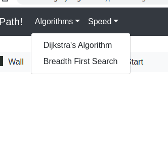

# Path Finding Algorithm Visualizer 

This is a simple web-based application created by me and my team-mate Piyush kumar  while working under the Microsoft Mars Colonization Program and in process developing our own path-finding algorithm visualizer.

We have used simple technologies like:-

1. `HTML`.

2. `CSS`.

3. `JavaScript`.

Our web-app can serve the following functionalities:-

1. Select `Algorithm` of choice, mainly `Breadth-First-Search` and `Dijkstra's Algorithm`.

2. Select `speed of animation`

